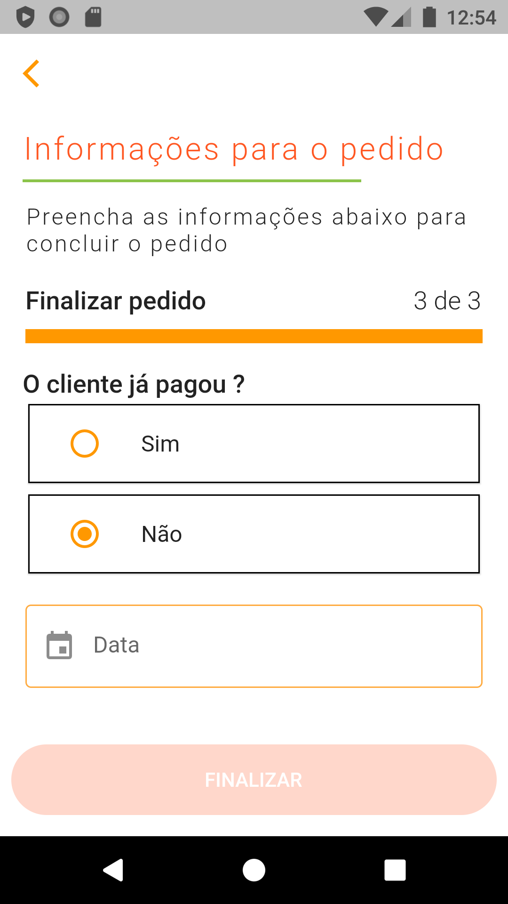

# Appetit

Um aplicativo feito com Flutter para a vaga de desenvolvedor Flutter na Maida.tech

## Getting Started

Esse app foi desenvolvido utilizando os conceitos:
* "Arquitetura Limpa"
* "Padrões de Design"
* SOLID
* TDD (foi usado no início do desenvolvimento, porém foi "abandonado" pois iria aumentar o tempo de desenvolvimento e provávelmente perdendo o prazo)

    ### Disclaimer

    * No aplicativo é feita a simulação de requisições http, já que não existem uma API, e existe uma geração aleatória de um booleano, que simularia uma resposta **200 OK** ou respostas de **falha** entre (**400** e **500**)
    * Os dados das respostas estão mockados, onde deveriam estar o retorno desses dados de uma API
    * Os testes de requisição http estão falhando pelos motivos acima citados
    * O aplicativo não possui um tratamento de responsividade, sendo desenvolvido totalmente com foco em celulares, por conta do prazo.

### Clean Archtectute


Logo fica estruturado da seguinte maneira:
* data
    *  implementa os casos de uso do dominio
* domain
    * contém as regras de negócio e entidades
* main
    * core da aplicação
* infra
    * faz a conexão com bibliotecas externas
* presentation
    * contém os presenters das telas
* ui
    * contém as telas e componentes do aplicativo
* validation
    * contém os arquivos com as validações dos campos

### Design Patterns

Os padrões de design utilizados foram:
* Factory
* Builder
* Composite
* Adapter


### Videos
[APPTETIT Parte 1](https://www.youtube.com/watch?v=6JXzf9anukI&feature=youtu.be "Parte 1")

[APPTETIT Parte 2](https://youtu.be/PpK1o5GmW8E "Parte 2")

### Tests

O projeto possue testes unitários e testes de widget
Para realizer os testes basta seguir a "receita":

```flutter
flutter pub get
flutter test
```

### APK

O apk fica disponível para download em:


### Screenshots

Os prints das telas ficam disponível em:
<table>
  <tr>
    <td></td>
    <td></td>
     <td></td>
     <td></td>
  </tr>
  <tr>
    <td></td>  
  </tr>
  <tr>
    <td></td>
    <td></td>
  </tr>
  <tr>
    <td></td>
    <td></td>
  </tr>
  <tr>
    <td></td>
    <td></td>
  </tr>
  <tr>
    <td></td>  
  </tr>
 </table>

